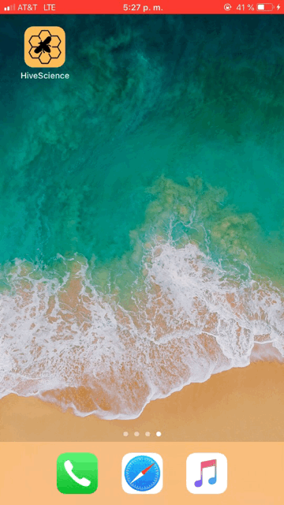

# Rype
Rype iOS Application 

It's very easy to make some words **bold** and other words *italic* with Markdown. You can even [link to Google!](http://google.com)

# Images
 
**Add**

**Animated**

**Photo**

**Recipes**

**Remove**

**Restrict**

