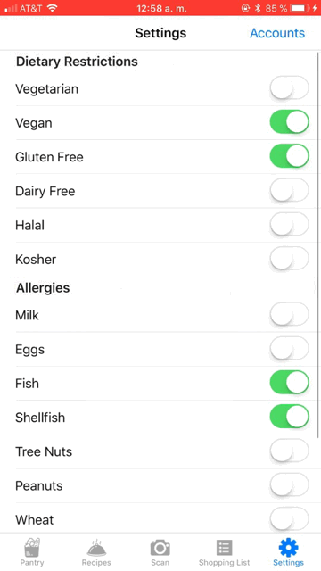

# Rype 

Rype is a smart kitchen assistant iOS application that helps you buy, cook, and eat as sustainably as possible. By tracking your purchasing and consumption habits, Rype return a list of recipes (from over 200,000 recipes scraped from blogs and cooking sites) that you can make using the ingredients you have. Rype knows the average expiration dates of the food you add to your virtual pantry and learns what foods you're most likely to waste, which allows it to sustainably prioritize the recipes it suggests to minimize your food waste and help you make smarter shopping decisions.  

# Track the Ingredients in your Pantry

Manually add newly purchased ingredients to your virtual pantry with a few clicks 

To save time, scan your receipt or shopping list and let our optical character recognition software add your ingredients automatically.  

When you’ve used up an ingredient, delete it from your virtual pantry and decide whether to add it to your shopping list. 

# Determine the most sustainable meals to make! 

Rype knows the lifespan of each ingredient you add to your pantry. It observes your habits over time and gradually understands how and when you use (or waste) each ingredient. 

When it’s time for a meal, let Rype tell you what recipes you can make using the ingredients you have (from a selection of over 200,000 recipes scraped from cooking websites and blogs)! 

The recipes Rype returns are sustainably prioritized to use the ingredients in your pantry that are expiring soonest, as well as the ingredients that you personally are most at risk of wasting. 

# Make it personal

Customize your dietary restrictions to filter the recipes Rype offers you.

You can also choose to have Rype send you notifications if ingredients close to their expiration date. 

